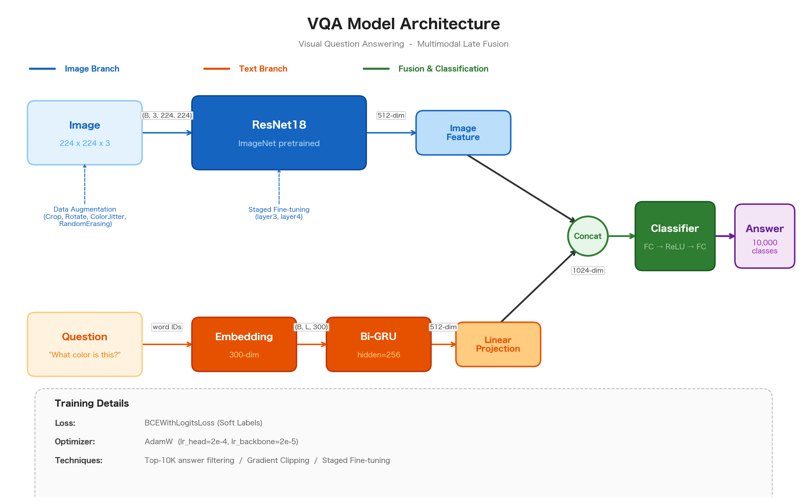

# VQA — Visual Question Answering

画像と質問文から適切な回答を予測する VQA タスクに取り組む。

## 概要

- **データセット**: [VizWiz 2023 edition](https://www.kaggle.com/datasets/nqa112/vizwiz-2023-edition)
  - 24,842 枚の画像 + 各画像に対する質問文 + 10 人の回答
  - 訓練: 19,873 サンプル / テスト: 4,969 サンプル
- **タスク**: 画像と質問文のペアから回答文を予測
- **ベースライン精度**: 49.4%（改善目標 60%）

## モデルアーキテクチャ



### Image Branch
- **ResNet18**（ImageNet 事前学習済み）を特徴抽出に使用
- Staged Fine-tuning: 段階的に層を解凍して学習
  - Stage 0: backbone 凍結（head のみ学習）
  - Stage 1: layer4 解凍
  - Stage 2: layer3 + layer4 解凍
- Data Augmentation: RandomCrop, Rotation, ColorJitter, RandomErasing

### Text Branch
- **Embedding**（300 次元）→ **Bi-GRU**（hidden=256）→ **Linear Projection**（512 次元）
- Self-Attention で GRU 出力を集約

### Fusion & Classification
- Image Feature (512) と Text Feature (512) を **Concat** → 1024 次元
- FC → ReLU → FC → **10,000 クラス分類**

### 訓練設定
| 項目 | 値 |
|---|---|
| 損失関数 | BCEWithLogitsLoss（Soft Labels） |
| Optimizer | AdamW（lr_head=2e-4, lr_backbone=2e-5） |
| Gradient Clipping | max_norm=1.0 |
| Top-K 回答フィルタリング | K=10,000 |

## ディレクトリ構成

```
vqa/
├── baseline.ipynb                              # 改善済みノートブック（メイン）
├── DL_Basic_2025_Competition_VQA_baseline.ipynb # 配布ベースライン
├── docs/
│   └── architecture.png                        # モデルアーキテクチャ図
├── data/                                       # データセット（Git 管理外）
│   ├── train/                                  # 訓練画像
│   ├── valid/                                  # テスト画像
│   ├── train.json                              # 訓練アノテーション
│   └── valid.json                              # テストアノテーション
├── model.pt                                    # 学習済み重み
├── submission.npy                              # 予測結果
└── submission.zip                              # 提出用 zip
```

## セットアップ

### 依存ライブラリ

```
torch
torchvision
numpy
pandas
Pillow
```

### データ配置

1. [VizWiz 2023 edition](https://www.kaggle.com/datasets/nqa112/vizwiz-2023-edition) から `data.zip` をダウンロード
2. プロジェクトルートに配置して展開:
   ```bash
   unzip data.zip
   ```
3. `data/train/`, `data/valid/`, `data/train.json`, `data/valid.json` が存在することを確認

## 使い方

### Google Colab

1. `baseline.ipynb` を Colab にアップロード
2. Google Drive に `data.zip` を配置
3. ノートブック冒頭のセルで Drive マウント → データ展開
4. 上から順にセルを実行

### ローカル

1. 依存ライブラリをインストール
2. データを `data/` ディレクトリに配置
3. `baseline.ipynb` を Jupyter で実行（GPU 推奨）

### 出力

- `model.pt` — 学習済みモデルの重み
- `submission.npy` — テストデータに対する予測結果
- `submission.zip` — 提出用 zip（submission.npy + model.pt + ノートブック）

## 評価指標

[VQA 公式メトリクス](https://visualqa.org/evaluation.html)を使用:

$$\text{Acc}(ans) = \min\!\left(\frac{\text{その回答と一致した人数}}{3},\; 1\right)$$

- 10 人の回答者のうち 9 人を選ぶ 10 パターンの平均を、各サンプルの Accuracy とする
- 前処理: lowercase 化、冠詞の削除、数詞→数字変換 など

## ベースラインからの改善点

| 改善手法 | ベースライン | 改善後 |
|---|---|---|
| 画像モデル | ResNet18（学習なし） | ResNet18（ImageNet pretrained + Staged Fine-tuning） |
| テキストエンコーダ | one-hot → Linear | Embedding → Bi-GRU + Self-Attention |
| 出力クラス数 | 全語彙（40,244） | Top-K フィルタリング（K=10,000） |
| ラベル | Hard Label（最頻値） | Soft Label（回答分布） |
| 損失関数 | CrossEntropyLoss | BCEWithLogitsLoss |
| Optimizer | Adam | AdamW |
| 正則化 | なし | Gradient Clipping, Dropout, RandomErasing |
| データ拡張 | Resize のみ | RandomCrop, Rotation, ColorJitter, RandomErasing |
| 画像正規化 | なし | ImageNet mean/std で正規化 |
